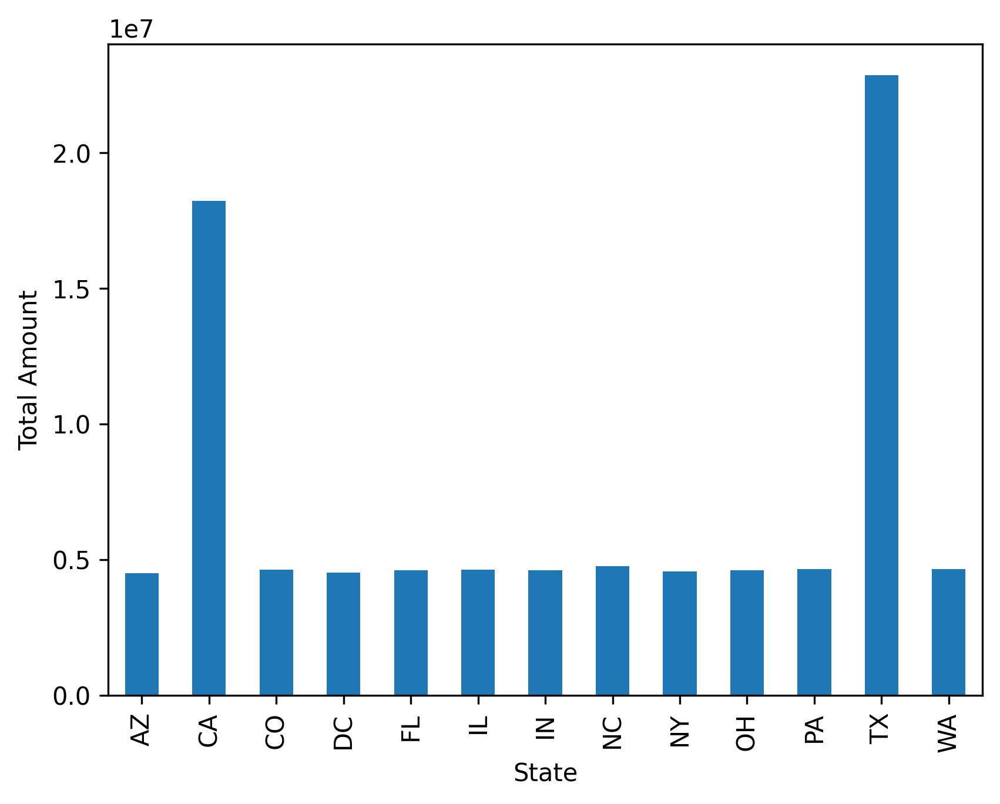
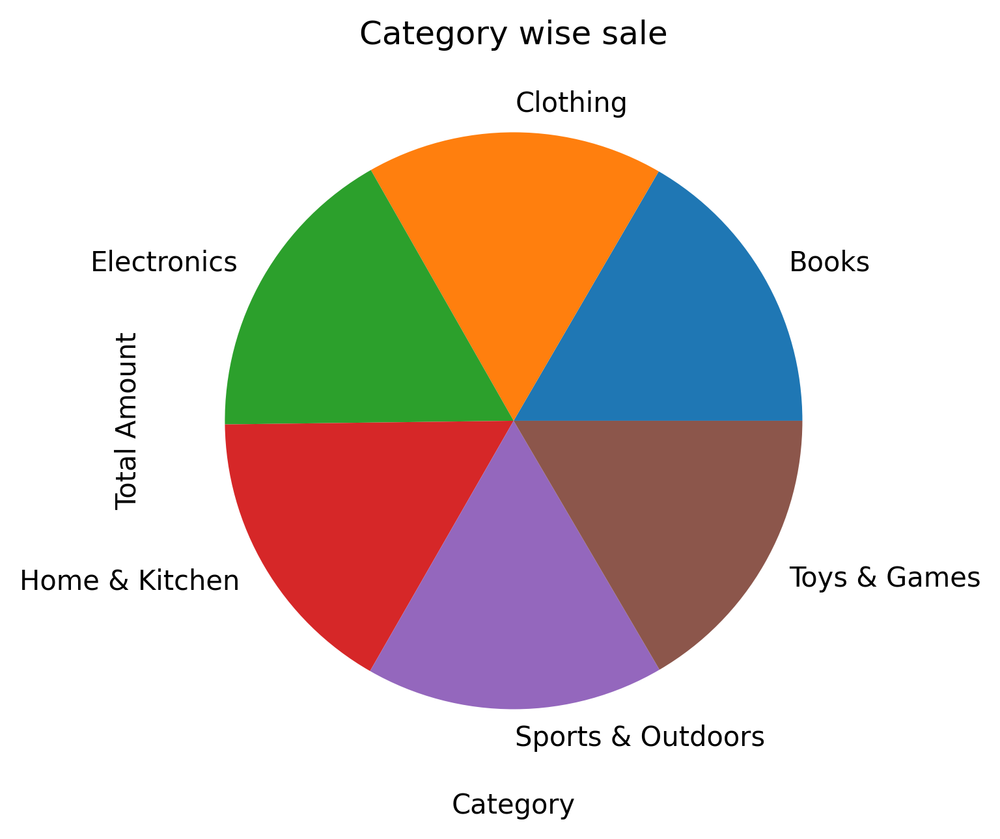
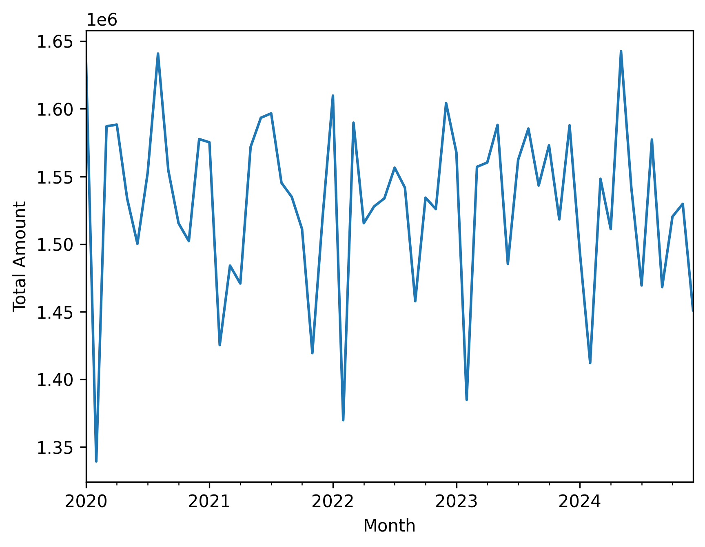
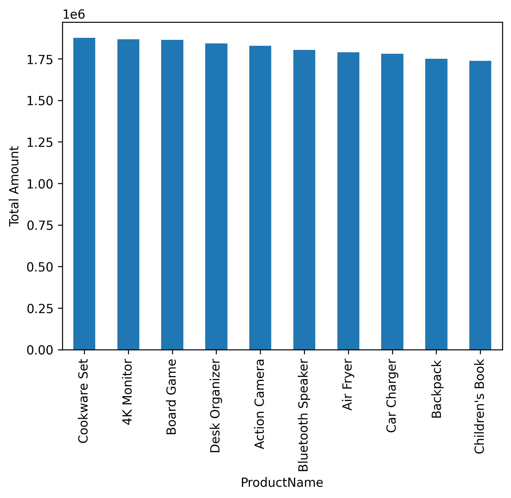

# Amazon Sales Analysis using Python

## Project Overview

This project demonstrates data analysis using Python by exploring an Amazon sales dataset from kaggle. The analysis focuses on calculating key performance indicators (KPIs), answering business-related questions, identifying sales trends, and creating meaningful visualizations using Pandas and Matplotlib.

---

## Objectives

- Load and explore the dataset
- Perform data cleaning and preprocessing
- Calculate key business KPIs
- Analyze sales across different states and categories
- Identify top-performing products and customers
- Analyze customer payment preferences
- Perform time-based sales analysis
- Create insightful visualizations
- Generate business recommendations based on the analysis

---

## Technologies Used

- Python
- Pandas
- NumPy
- Matplotlib
- OpenPyXL
- Google Colab

---

## Dataset

The dataset contains Amazon sales transaction records with information such as:

- Order ID
- Order Date
- Customer Details
- Product Details
- Category
- Quantity
- Unit Price
- Total Amount
- Payment Method
- City
- State

---

## Analysis Performed

The notebook includes the following analyses:

- Dataset overview
- Data exploration
- KPI calculations
  - Total Sales
  - Total Orders
  - Average Order Value
  - Maximum Sales
  - Minimum Sales
- Sales by State
- Sales by Category
- Sales by Sub-Category *(if available)*
- Top 10 Products by Sales
- Top 5 Customers by Sales
- Payment Method Analysis
- Monthly Sales Trend
- Multi-level Sales Analysis using `groupby()`
- Business Insights and Recommendations

---

## Visualizations

The following visualizations were created to better understand the sales data and identify business insights.

### Sales by State



---

### Sales by Category



---

### Monthly Sales Trend



---

### Top 10 Products by Sales



---

## Key Concepts Practiced

- Reading Excel files using Pandas
- Exploring and understanding datasets
- Data cleaning and preprocessing
- Filtering and sorting data
- Grouping and aggregation using `groupby()`
- Statistical analysis
- KPI calculation
- Working with date and time data
- Data visualization using Matplotlib
- Generating business insights from data

---

## Skills Demonstrated

- Python Programming
- Data Analysis
- Exploratory Data Analysis (EDA)
- Data Visualization
- Business Analytics
- Problem Solving
- Pandas
- NumPy
- Matplotlib

---

## Repository Structure

```
amazon-sales-analysis-python/
│
├── Amazon_Sales_Analysis.ipynb
├── README.md
├── requirements.txt
├── amazon.xlsx          # Optional
└── images/              # Optional
    ├── sales_by_state.png
    ├── category_sales.png
    ├── monthly_sales_trend.png
    └── top10_products.png
```

---

## Requirements

Install the required libraries using:

```bash
pip install -r requirements.txt
```

---

## How to Run

1. Clone this repository.

```bash
git clone https://github.com/Shamla-Isthikar/amazon-sales-analysis-python.git
```

2. Install the required dependencies.

```bash
pip install -r requirements.txt
```

3. Open **Amazon_Sales_Analysis.ipynb** using Jupyter Notebook or Google Colab.

4. Run all cells to reproduce the analysis and visualizations.

---

## Future Improvements

- Create an interactive dashboard using Plotly or Power BI.
- Perform customer segmentation and sales forecasting.
- Build predictive models using machine learning.
- Automate report generation.

---

## Author

**Shamla Isthikar**

- GitHub: https://github.com/Shamla-Isthikar

---

## License

This project is shared for educational and portfolio purposes.
